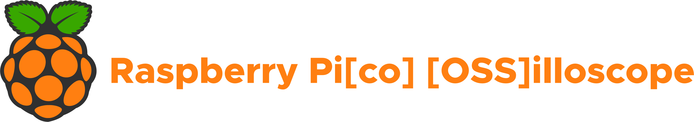

  

### About

This project is an open source project to build an oscilloscope out of the $4 Raspberry Pi Pico. It uses a Raspberry Pi (or any other device) to host a webpage and display data streamed from the 4 analog-to-digital converters on the Pico.

### Code Structure

Code in the `app` folder is the Node.js powered web-based interface (running on a Raspberry Pi) which gathers and displays the data coming from the Pico.

Code in the `src` folder lives on the Raspberry Pi Pico and streams analog data over the serial port. It also accepts serial configuration commands... see below.

### Pico Serial Commands
Serial Communications run at an approximate baudrate of 3Mb/s.

Sending Configuration: To configure the pico, you must send a frequency value as an unsigned 32-bit integer in little-endian. Those four bytes must be sent contiguously, any data-loss will require resending of this frequency. (TODO: Accept 4 frequency values for the 4 channels)

Recieving Readings: The pico with send 8 bytes of data over serial at approximately the frequency it is configured. Each set of two bytes represents the reading from a pin as an unsigned 16-bit integer in little endian. The data can be interpreted as an array of values with the first two bytes being reading from channel 1, the next pair is the reading from channel 2, etc.

### Developing

To develop on the webpage, use the command `npm run-script local` in the `app/` folder (must have done an `npm install` first). This will open the webpage in your default browser.

### Building the UI

To compile the react.js front-end, use `npm run-script build` in the `app/` directory. Once it compiles, use `node server.js` to host the webpage at `localhost:8080` and to start the back-end server for communicating with the Raspberry Pi Pico
